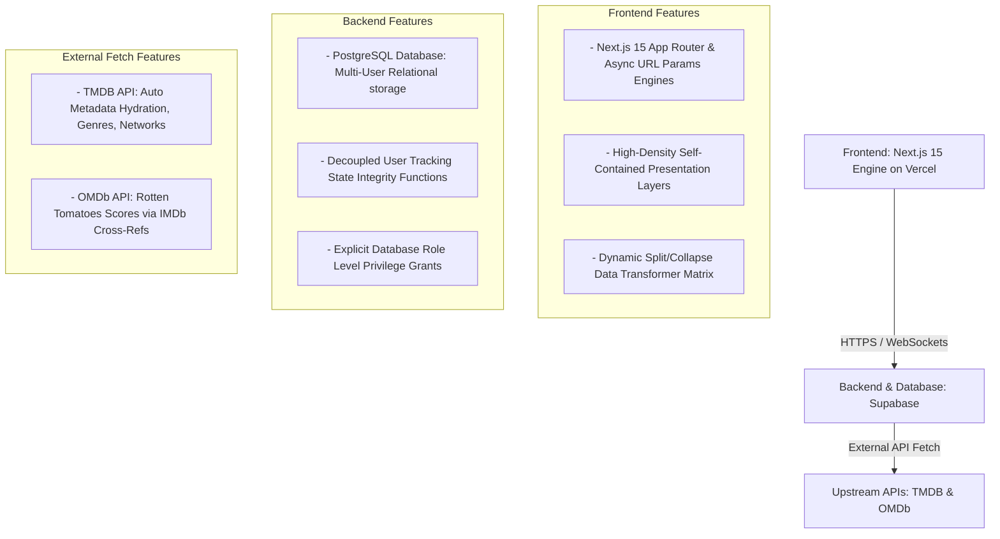

# GEMINI.md - Media Tracker Operational State Checkpoint

This document serves as the live architectural specification, system blueprint, and current project checkpoint state for our shared Movie/TV Series Kanban Tracking Application.

## 1. Complete System Architecture

The application uses a modern, serverless SaaS architecture optimized for real-time updates, single-viewport layouts, and high-density information display.



### Core Tech Stack Decisions
*   **Frontend Framework**: Next.js 15 App Router. To guarantee styling safety and zero compilation blocks across Next.js asynchronous asset compilation channels during structural file changes, the presentation layer uses highly responsive, isolated inline styling attributes matching Stitch's light-mode command theme.
*   **Database Infrastructure**: Supabase (PostgreSQL) managed programmatically via the Supabase CLI. Local environment spins up via `supabase start` on Docker Desktop with explicit table permissions granted to the `anon` web client role to prevent `42501` access blocks.
*   **Open Source License**: GNU Affero General Public License v3.0 (AGPL-3.0) committed to the repository root.
*   **Testing Suite**: Vitest + JSDOM for isolated test-driven server actions and component cleanup verifications.

---

## 2. Active Repository Folder Structure

```text
/media-tracker-repo
├── .github/workflows/
│   ├── deploy-frontend.yml     # Vercel deployment pipeline
│   └── supabase-migrate.yml    # Supabase DB CI/CD migration pipeline (Muted via workflow_dispatch)
├── supabase/                       # Managed via Supabase CLI
│   ├── config.toml                 # Allowed redirect URLs configuration array
│   ├── seed.sql                    # Automagic mock data loader (Seeded multi-user split/collapse rows)
│   └── migrations/                 # Local programmatic database state history
│       └── 20260729000000_init.sql # Relational schemas, enums, triggers, and table privilege grants
└── web-app/                        # Next.js Frontend Core Container
    ├── src/
    │   ├── actions/                # Server Actions
    │   │   ├── kanban.ts           # State modifiers & smart TV season progression logic
    │   │   └── tmdb.ts             # Predictive multi-search lookups & server-side metadata hydration
    │   ├── app/                    # Next.js App Router layout endpoints
    │   │   ├── auth/callback/      # OAuth session handshake route
    │   │   ├── dashboard/          # Main single-viewport 5-column Kanban board view
    │   │   ├── login/              # Entry screen with Google Auth & Dev Bypass toggles
    │   │   ├── globals.css         # Reset stylesheet and 5-column horizontal layout frame
    │   │   └── layout.tsx          # Master layout component
    │   ├── components/kanban/      # UI Modular Elements
    │   │   ├── AddMediaInput.tsx   # Autocomplete input box + browser searchParams URL filter router
    │   │   ├── LaneHeader.tsx      # High-density light columns metrics and color status dots
    │   │   ├── MediaRowCard.tsx    # Expandable drawer container with embedded Stitch status pills
    │   │   └── UserProgressControl.tsx # Scoped husband/wife divergent tracking controllers & forms
    │   └── types/                  # Database-generated TypeScript interfaces & kanban.ts structures
    ├── middleware.ts               # Core route protection gate interception script
    ├── vitest.config.ts            # Vitest unit execution pipeline settings
    └── package.json                # Single-tier app dependency nodes and testing execution triggers
```

---

## 3. High-Density Relational Schema Layout

### `profiles`
Tracks individual user metrics. Automatically provisioned via a PostgreSQL trigger on authentications.
*   `id`: UUID (Primary Key, points to Auth profile logs)
*   `display_name`: TEXT
*   `avatar_url`: TEXT

### `media_items`
Central cache for movie/TV show metadata to eliminate duplicate network lookup operations.
*   `id`: UUID (Primary Key, autogenerated)
*   `tmdb_id`: TEXT (Unique)
*   `imdb_id`: TEXT
*   `title`: TEXT
*   `type`: ENUM ('movie', 'tv')
*   `description`: TEXT
*   `rotten_tomatoes_score`: INT (Supports `null` values cleanly via explicit interfaces)
*   `streaming_services`: JSONB (Array of names and platform logo urls)
*   `genres`: TEXT[]
*   `total_seasons`: INT

### `user_media_states`
Tracks individual progress mapping entries. Interest is implicitly represented by the presence of a row record.
*   `id`: UUID (Primary Key)
*   `profile_id`: UUID (Foreign Key -> `profiles.id`)
*   `media_item_id`: UUID (Foreign Key -> `media_items.id`)
*   `state`: ENUM ('long_list', 'short_list', 'watching', 'watched')
*   `current_season`: INT (Defaults to 1)

---

## 4. Current Progress & UI Fixes Applied

*   **Multi-User Data Model Pivot Complete**: Simplified state tracking mechanics down to four fundamental entities (`long_list`, `short_list`, `watching`, `watched`). 
*   **Database Availability Integrity Constraint**: Implemented a Postgres check constraint (`check_streaming_availability`) that automatically rejects items lacking active streaming provider arrays from entering tracking lanes.
*   **Table Role Level Permissions Configured**: Extended explicit `SELECT, INSERT, UPDATE, DELETE` grants to the `anon` developer role inside the core initialization script to resolve Postgres `42501` permission errors.
*   **Next.js 15 Asynchronous Compatibility Patched**: Updated `DashboardPage` and `AddMediaInput` to support Next.js 15's async `searchParams` promise un-wrapping natively.
*   **Frontend Splitting & Collapsing Transformer Matrix**: Implemented an automated loop engine that collapses convergent items (*Game of Thrones*) into a single consolidated row card with a `Both` tag, while splitting divergent items (*Fight Club*) across separate functional columns concurrently with independent `Husband` and `Wife` identifier badges.

---

## 5. Next Session Implementation Todo List

When starting a new session, resume implementation at **Phase 4**:

### Phase 4: Real-time Sync & Polish
- [ ] Connect the dashboard component views to client-side Supabase Real-time Channel subscriptions (`supabase.channel().on('postgres_changes')`) to catch card movements and immediately force visual re-validation across other browsers instantly over WebSockets.
- [ ] Test the smart TV season progression validation trigger end-to-end (Verify that clicking "➔ Watched" on an active show auto-increments tracked progress by 1 season and bounces the row card back to the Shortlist lane).
- [ ] Configure live production OAuth client IDs inside Google Cloud Developer Console.
- [ ] Generate standard Progressive Web App (PWA) manifest parameters to enable clean local installation behaviors on Android mobile platforms.
