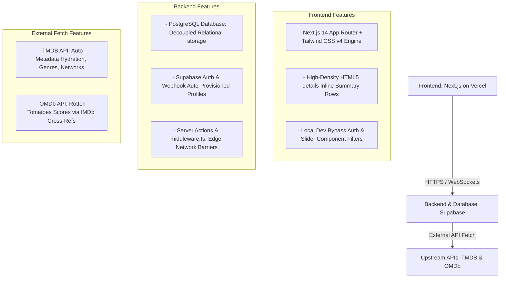

# GEMINI.md - Media Tracker Operational State Checkpoint

This document serves as the live architectural specification, system blueprint, and current project checkpoint state for our shared Movie/TV Series Kanban Tracking Application.

## 1. Complete System Architecture

The application uses a modern, serverless SaaS architecture optimized for real-time updates, single-viewport layouts, and high-density information display.



### Core Tech Stack Decisions
*   **Frontend Framework**: Next.js 14 App Router with the **Tailwind CSS v4** Oxide styling compiler architecture.
*   **Database Infrastructure**: Supabase (PostgreSQL) managed programmatically via the Supabase CLI with custom database table privileges explicitly granted to the `anon` developer role.
*   **Open Source License**: GNU Affero General Public License v3.0 (AGPL-3.0) committed to the repository root.
*   **Testing Suite**: Vitest + JSDOM for isolated test-driven server actions and component cleanup verifications.

---

## 2. Active Repository Folder Structure

```text
/media-tracker-repo
├── .github/workflows/
│   ├── deploy-frontend.yml     # Vercel deployment pipeline
│   └── supabase-migrate.yml    # Supabase DB CI/CD migration pipeline
├── supabase/                       # Managed via Supabase CLI
│   ├── config.toml                 # Allowed redirect URLs configuration array
│   ├── seed.sql                    # Automagic mock data loader (Husband/Wife divergent progress)
│   └── migrations/                 # Local programmatic database state history
│       └── 20260729000000_init.sql # Database schema, enums, triggers, and permissive anon/auth RLS
└── web-app/                        # Next.js Frontend Core Container
    ├── src/
    │   ├── actions/                # Server Actions
    │   │   ├── kanban.ts           # State modifiers & smart TV season progression logic
    │   │   └── tmdb.ts             # Predictive multi-search lookups & server-side metadata hydration
    │   ├── app/                    # Next.js App Router layout endpoints
    │   │   ├── auth/callback/      # OAuth session handshake route
    │   │   ├── dashboard/          # Main single-viewport 5-column Kanban board view
    │   │   ├── login/              # Entry screen with Google Auth & Dev Bypass toggles
    │   │   ├── globals.css         # Tailwind v4 engine configurations and inline row style overrides
    │   │   └── layout.tsx          # Master layout component
    │   ├── components/kanban/      # UI Layout Elements
    │   │   ├── AddMediaInput.tsx   # Premium dark charcoal search bar and slide-track selectors
    │   │   └── ProgressBadge.tsx   # Unit-tested individual split user progress indicators
    │   └── types/                  # Database-generated TypeScript interfaces & kaban.ts structures
    ├── middleware.ts               # Core route protection gate interception script
    ├── vitest.config.ts            # Vitest unit execution pipeline settings
    └── package.json                # Single-tier app dependency nodes and testing execution triggers
```

---

## 3. High-Density Relational Schema Layout

### `profiles`
Tracks individual user metrics. Automatically provisioned via a PostgreSQL trigger on authentications.
*   `id`: UUID (Primary Key, points to Auth profile logs)
*   `display_name`: TEXT
*   `avatar_url`: TEXT

### `media_items`
Central cache for movie/TV show metadata to eliminate duplicate network lookup operations.
*   `id`: UUID (Primary Key, autogenerated)
*   `tmdb_id`: TEXT (Unique)
*   `imdb_id`: TEXT
*   `title`: TEXT
*   `type`: ENUM ('movie', 'tv')
*   `description`: TEXT
*   `rotten_tomatoes_score`: INT
*   `streaming_services`: JSONB (Array of names and platform logo urls)
*   `genres`: TEXT[]
*   `total_seasons`: INT

### `user_media_states`
Tracks individual progress mapping entries. Handles multi-user divergent tracking metrics on identical shows (e.g., Husband on Season 2, Wife on Season 1 simultaneously).
*   `id`: UUID (Primary Key)
*   `profile_id`: UUID (Foreign Key -> `profiles.id`)
*   `media_item_id`: UUID (Foreign Key -> `media_items.id`)
*   `state`: ENUM ('not_available', 'available', 'prioritised', 'watching', 'watched')
*   `current_season`: INT (Defaults to 1)

---

## 4. Current Progress & UI Fixes Applied

*   **Single Viewport Grid Constraints**: Configured layout mechanics (`h-screen`, `overflow-hidden`, and `kanban-scroll-area`) to lock the entire 5-column dashboard within a single monitor screen frame without global page scrolling.
*   **High-Density Inline Accordions**: Implemented HTML5 `<details>` and `<summary>` components to keep the Kanban interface compact, allowing cards to open downwards in place when clicked.
*   **Layout Alignment Corrected**: Overrode Tailwind v4 block configurations with a dedicated CSS inline row layout. The cards now feature an executive summary row containing **Title ➔ Network Badge ➔ Mapped Genre Capsule Pills** sitting completely on a single line.
*   **Premium Background Aesthetics**: Added a distinct dark charcoal surface background color (`#0f172a`), border framing, and shadow depth to the rows to separate them cleanly from the lane columns.
*   **Input Form Transformation**: Refactored the search layout container to use a dark-glass entry box input field and a sliding-pill green selector element block.

---

## 5. Next Session Implementation Todo List

When starting a new session, resume implementation at **Phase 4**:

### Phase 4: Real-time Sync & Polish
- [ ] Connect the dashboard component views to client-side Supabase Real-time Channel subscriptions (`supabase.channel().on('postgres_changes')`) to catch card movements and immediately force visual re-validation across other browsers instantly over WebSockets.
- [ ] Test the smart TV season progression validation trigger end-to-end (Verify that clicking "➔ Watched" on an active show auto-increments tracked progress by 1 season and bounces the row card back to the Shortlist lane).
- [ ] Configure live production OAuth client IDs inside Google Cloud Developer Console.
- [ ] Generate standard Progressive Web App (PWA) manifest parameters to enable clean local installation behaviors on Android mobile platforms.
