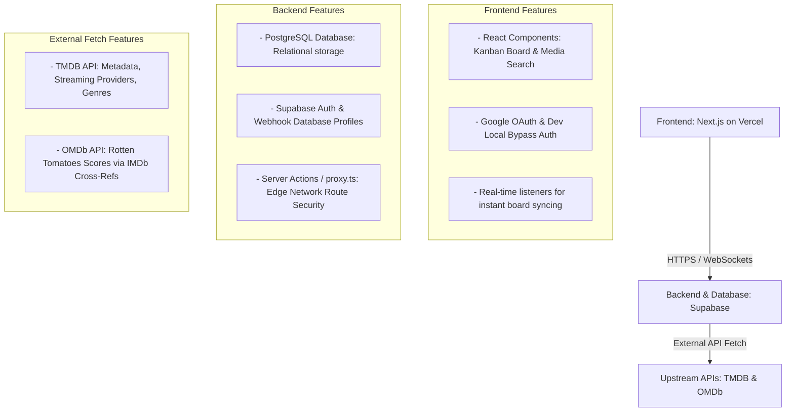

# GEMINI.md - Media Tracker Planning, Architecture & State Sync

This document serves as the live specification, system blueprint, and current project checkpoint state for our shared Movie/TV Series Kanban Tracking Application.

## 1. System Architecture

The application uses a modern, serverless SaaS architecture optimized for real-time updates and zero-cost hobby tiers.



### Core Tech Stack Decisions
*   **Frontend & Hosting**: Next.js App Router deployed natively on Vercel.
*   **Database & Infrastructure**: Supabase (PostgreSQL) managed programmatically via the Supabase CLI.
*   **Open Source License**: GNU Affero General Public License v3.0 (AGPL-3.0) committed to the root repository.
*   **Testing Engine**: Vitest + JSDOM for isolated test-driven server actions and UI component verification.

---

## 2. Active Repository Folder Structure

```text
/media-tracker-repo
├── .github/
│   └── workflows/
│       ├── deploy-frontend.yml     # Vercel deployment pipeline
│       └── supabase-migrate.yml    # Supabase DB CI/CD migration pipeline
├── supabase/                       # Managed via Supabase CLI
│   ├── config.toml                 # Local configuration variables & allowed URL redirects
│   ├── seed.sql                    # Automagic mock data loader (Husband/Wife divergent progress)
│   └── migrations/                 # Local programmatic database state history
│       └── 20260729000000_init.sql # Database schema, enums, triggers, and permissive anon/auth RLS
└── web-app/                        # Next.js Frontend Core Container
    ├── src/
    │   ├── actions/                # Server Actions (tmdb.ts metadata, kanban.ts state triggers)
    │   ├── app/                    # Next.js App Router endpoints
    │   │   ├── auth/callback/      # OAuth session handshake route
    │   │   ├── dashboard/          # Main 5-column server-side rendered Kanban board view
    │   │   └── login/              # Landing screen with Google Auth & Dev Bypass toggles
    │   ├── components/kanban/      # UI Cards, ProgressBadges, and predictive inputs
    │   ├── lib/supabase/           # Browser connection clients and server instance initializers
    │   ├── test/                   # Isolated test configuration context (setup.ts cleaning hooks)
    │   └── types/                  # Local TypeScript definitions & auto-generated supabase.ts
    ├── package.json                # Bundled packages, lockfiles, and `npm run test` vitest hooks
    └── proxy.ts                    # Consolidated request path security interceptor
```

---

## 3. Relational Data Model Schema

### `profiles`
Tracks individual user metrics. Automatically provisioned via a PostgreSQL trigger on authentications.
*   `id`: UUID (Primary Key, points to Auth profile logs)
*   `display_name`: TEXT
*   `avatar_url`: TEXT

### `media_items`
Central cache for movie/TV show metadata to eliminate duplicate network lookup operations.
*   `id`: UUID (Primary Key, autogenerated)
*   `tmdb_id`: TEXT (Unique)
*   `imdb_id`: TEXT
*   `title`: TEXT
*   `type`: ENUM ('movie', 'tv')
*   `description`: TEXT
*   `rotten_tomatoes_score`: INT
*   `streaming_services`: JSONB (Array of names and platform logo urls)
*   `genres`: TEXT[]
*   `total_seasons`: INT

### `user_media_states`
Tracks individual progress mapping entries. Handles multi-user divergent tracking metrics on identical shows.
*   `id`: UUID (Primary Key)
*   `profile_id`: UUID (Foreign Key -> `profiles.id`)
*   `media_item_id`: UUID (Foreign Key -> `media_items.id`)
*   `state`: ENUM ('not_available', 'available', 'prioritised', 'watching', 'watched')
*   `current_season`: INT (Defaults to 1)

---

## 4. Operational Checkpoint State & Fixes Applied

*   **Tree-Shaking**: Extraneous Next.js default landing parameters, styles, and public graphics purged.
*   **Monorepo Alignment**: Errant root-level node dependencies, lockfiles, and configs dropped. All project tooling isolated inside `/web-app`.
*   **Path Aliasing**: Imports refactored from old `@/app/actions/*` mappings to cleaner `@/actions/*` root-level structures.
*   **Next.js Proxy Upgrades**: Replaced deprecated `middleware.ts` tracking structures with the modern standard edge **`proxy.ts`** configuration.
*   **Authentication Local Bypass**: Built a secure local cookie system (`dev-mock-session`) to allow instant browser dashboard testing without setting up cloud OAuth variables upfront.
*   **Database RLS Adjustments**: Relaxed PostgreSQL RLS targets locally to explicitly recognize `anon` permissions, resolving the empty loading state block.

---

## 5. Next Session Implementation Todo List

### Phase 3: Interactive Dashboard Controls (Up Next)
- [ ] Add interactive UI column transition buttons to individual Kanban media cards.
- [ ] Connect card buttons to our implemented Server Action (`actions/kanban.ts`) to verify live database mutations.
- [ ] Conduct browser end-to-end confirmation that moving a TV show card to `Watched` executes our automated season advancement logic.

### Phase 4: Real-time Sync & Polish
- [ ] Implement Supabase client Real-time Channel subscriptions inside the dashboard interface to capture cross-device modifications instantly over WebSockets.
- [ ] Secure production Google OAuth keys via Google Cloud Developer Console.
- [ ] Add an Android PWA configuration schema manifest.
