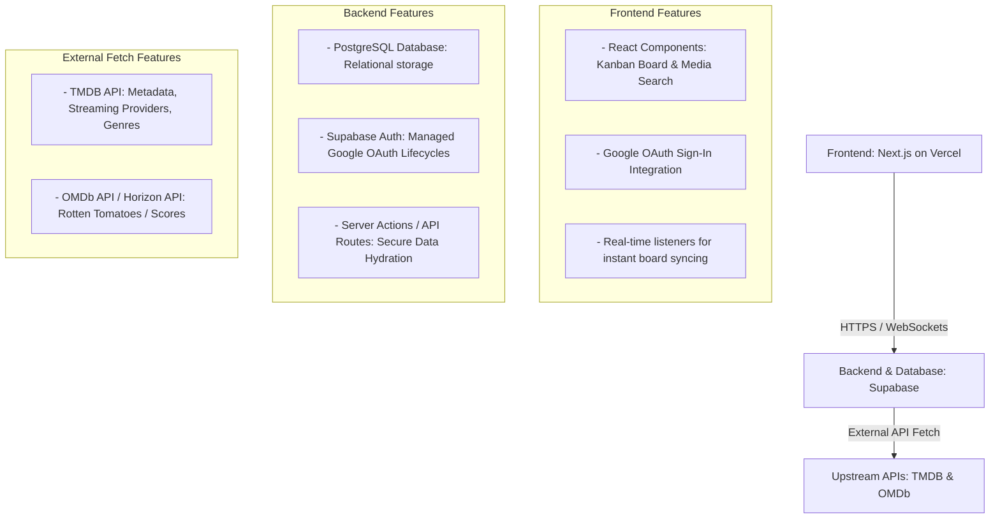

# GEMINI.md - Media Tracker Planning & Architecture

This document outlines the architecture, data models, functionality, and development roadmap for the shared Movie/TV Series Kanban Tracking Application.

## 1. System Architecture

The application uses a modern, serverless SaaS architecture optimized for real-time updates and zero-cost hobby tiers.



### Tech Stack Selection
*   **Frontend Deployment**: [Vercel](https://vercel.com) hosting a responsive **Next.js / React** web application (mobile-friendly for Android).
*   **Database & Backend**: [Supabase](https://supabase.com) providing PostgreSQL, native Google OAuth management, and real-time data synchronization.
*   **External APIs**: [The Movie Database (TMDB) API](https://themoviedb.org) for primary data metadata and streaming availability via JustWatch. [OMDb API](http://omdbapi.com) for Rotten Tomatoes scores.

---

## 2. Repository Folder Structure

A monorepo-style structure separates infrastructure-as-code (managed via Supabase CLI) from application source files, enabling automated continuous deployment pipelines.

```text
/media-tracker-repo
├── .github/
│   └── workflows/
│       ├── deploy-frontend.yml     # Vercel deployment pipeline
│       └── supabase-migrate.yml    # Supabase DB CI/CD migration pipeline
├── supabase/                       # Generated automatically by Supabase CLI
│   ├── config.toml                 # Local emulation configurations
│   ├── functions/                  # Optional Edge Functions
│   └── migrations/                 # SQL Migration files (Schema/RLS/Triggers)
│       ├── 20260729000000_init.sql # Core tables, Enums, and Google triggers
│       └── 20260729000001_rls.sql  # Row-Level Security rules
└── web-app/                        # Next.js App Router Frontend
    ├── src/
    │   ├── app/                    # App Router (Pages, Layouts, Server Actions)
    │   │   ├── auth/               # OAuth callbacks & login routing
    │   │   ├── dashboard/          # Main Kanban board view
    │   │   ├── layout.tsx
    │   │   └── page.tsx
    │   ├── components/             # Reusable UI components
    │   │   ├── kanban/             # Board, Column, and Card components
    │   │   └── ui/                 # Component library primitives (Shadcn/ui)
    │   ├── hooks/                  # Custom React hooks (Real-time synchronization)
    │   ├── lib/                    # Shared utilities
    │   │   ├── supabase/           # Browser, Server, and Middleware clients
    │   │   └── tmdb.ts             # API wrapper functions
    │   └── types/                  # Database-generated TypeScript interfaces
    ├── package.json
    └── tailwind.config.js
```

---

## 3. Relational Data Model

To support tracking a single TV show at different paces or separating individual watchlists, user progress is entirely decoupled from the media metadata.

### `profiles`
Tracks individual user metrics. Automatically provisioned via a PostgreSQL trigger after an initial Google OAuth handshake.
*   `id`: UUID (Primary Key, links to Supabase Auth)
*   `display_name`: TEXT
*   `avatar_url`: TEXT (Synced from Google Profile picture)

### `media_items`
Stores the global cached metadata for a movie or TV show to eliminate duplicate API requests.
*   `id`: UUID (Primary Key)
*   `tmdb_id`: TEXT (Unique)
*   `imdb_id`: TEXT
*   `title`: TEXT
*   `type`: ENUM ('movie', 'tv')
*   `description`: TEXT
*   `rotten_tomatoes_score`: INT
*   `streaming_services`: JSONB (Array of provider names and logo URLs)
*   `genres`: TEXT[] (Array of strings)
*   `total_seasons`: INT (For TV shows)

### `user_media_states`
Tracks the specific Kanban state and individual progress for a user on a piece of media. If an item is assigned to "both" at creation, two individual rows are mapped to this `media_item_id`.
*   `id`: UUID (Primary Key)
*   `profile_id`: UUID (Foreign Key -> `profiles.id`)
*   `media_item_id`: UUID (Foreign Key -> `media_items.id`)
*   `kanban_state`: ENUM ('not_available', 'available', 'prioritised', 'watching', 'watched')
*   `current_season`: INT (Default 1, ignored for movies)

---

## 4. Major Functionality & Automation Logic

### A. Smart TV Season Progression Trigger
When a user updates a TV series card state to `watched`:
1.  The system evaluates if `current_season` is less than `media_items.total_seasons`.
2.  **If a new season is available**: The system automatically updates the `user_media_states.kanban_state` back to `prioritised` (or `available`) and increments `current_season` by 1.
3.  **If no new seasons exist**: The card remains in the `watched` column.
4.  *Async Check*: A background check runs against the TMDB API to see if a newer season was recently released upstream. If found, `total_seasons` increments, and the card auto-advances.

### B. Automated Card Creation Workflow
1.  User types a title into the "Add Card" input field.
2.  Frontend debounces input and queries the TMDB search API endpoint.
3.  User selects the correct item from a visual dropdown list.
4.  User selects assignment tracking preference using a 3-way toggle button: **[ Both (Default) ] [ Husband Only ] [ Wife Only ]**.
5.  The backend triggers a combined fetch for metadata (`TMDB` + `OMDb` for Rotten Tomatoes scores).
6.  The `media_items` record is populated.
7.  The backend generates rows in `user_media_states` for the selected toggle option. (If `Both` is chosen, two distinct rows are generated for each user profile).

### C. Unified vs. Split Kanban Views
*   **Together View (Default)**: Aggregates cards where both users share the exact same state.
*   **Split Progress Indicator**: For TV shows where progress diverges, or items explicitly assigned to only one person, the card displays split avatars showing individual states (e.g., "Wife: S1 (Watching) | Husband: S2 (Prioritised)").

---

## 5. Implementation Todo List

### Phase 1: Foundations, Auth & Database Setup
- [ ] Create Supabase project and configure local environment via CLI (`supabase init`).
- [ ] Draft initial migration file containing schema definitions, enums, and tables.
- [ ] Configure Google Cloud Console OAuth credentials and enable Google Auth provider in Supabase.
- [ ] Create database trigger to automatically map authentication sign-ins to the public `profiles` record.
- [ ] Register for TMDB and OMDb API developer keys; assign them as production secret environment variables.
- [ ] Implement Row-Level Security (RLS) policies allowing shared read/write data actions between accounts.

### Phase 2: Backend API & Automation Logic
- [ ] Create Next.js server actions for text-based autocomplete lookups pointing to TMDB.
- [ ] Construct backend hydration workflow (Accepting a TMDB ID, parsing raw data endpoints, fetching Rotten Tomatoes scores, and caching into SQL data records).
- [ ] Program SQL relational evaluation rules to process `watched` state conversions for TV seasons.

### Phase 3: Frontend UI Development
- [ ] Initialize Next.js project with Tailwind CSS and shadcn/ui.
- [ ] Build clean landing entry views with customized "Sign in with Google" layout triggers.
- [ ] Build responsive multi-column Kanban board layouts (`Not Available`, `Available`, `Prioritised`, `Watching`, `Watched`).
- [ ] Bind component states to real-time Supabase snapshot listeners to capture edits cross-device instantly.
- [ ] Develop the "Add Media" configuration modal featuring autocomplete inputs and the 3-way distribution toggle.
- [ ] Build individual item cards containing interactive streaming service asset banners, ratings, and independent user badge groupings.

### Phase 4: Polish & Deployment
- [ ] Add filter controls to cycle board perspectives ("My Board", "Wife's Board", "Shared Sync").
- [ ] Write targeted invalidation rules to instantly re-check platform access details on command.
- [ ] Append configuration files and web icons required to enable standard Progressive Web App (PWA) installation routines on mobile platforms.
- [ ] Deploy frontend distribution assets to Vercel production edge systems.